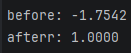
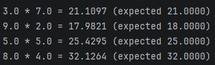
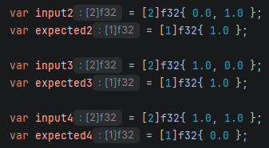
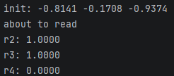

# znn
A simple neural network written from scratch in Zig

# Under the Hood
In znn, the network is built with multiple `Layer`s. They store weights and biases as flat float arrays, they have two methods - forward and backward.
Forward computes a weighted sum of inputs with bias added with ReLU activation for the hidden layers and linear activation for output layers.

The `Network` struct chains the layers. Buffers are preallocated for efficiency and they pass data between layers, `forward` feeds output of each layer into the next.

Cool thing is, this network can actually learn (🤯). The way it works is that given an expected output, it computes how wrong each weight was and nudges them into the right direction using gradient descent.

The learning was proved by running `forward` and `backward` repeatedly until the network converges towards the target, it starts at a random guess and reaches the target within 1000 iterations.

I ran a 5 million iteration training stage on the network to learn multiplication, here is what it done:

It's okay, but very impressive for the size of the architecture.

I tested XOR to ensure training was actually happening. I ran i through three inputs and expected results:

So that's: `0 xor 1 = 1`, `1 xor 0 = 1`, `1 xor 1 = 0`. And the results are successful:

It learnt to XOR without me telling it to do so after 100,000 iterations.